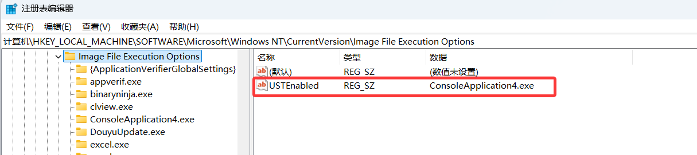
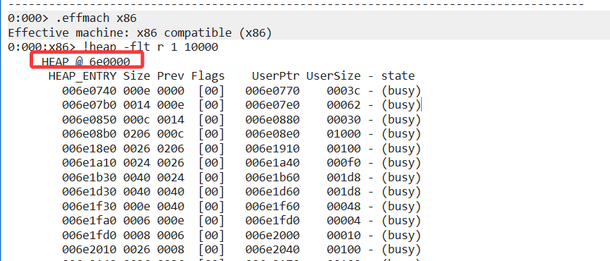

### 内存泄漏分析


#### um

1.先抓dump,看看是堆泄漏还是句柄泄漏、GDI泄漏，要分场景分析。 这里用户层先以堆内存泄漏分析吧。

2.大部分情况是要精确到具体泄漏代码堆栈的，所以需要用到gflags。

```
gflags.exe /i ConsoleApplication4.exe +ust
```

他本质上是修改注册表，

```
HKEY_LOCAL_MACHINE\SOFTWARE\Microsoft\Windows NT\CurrentVersion\Image File Execution Options
```



用完gflags去注册表看下，可能没设置成功。


开启这个标志后，内存会涨的很快(这个方法的缺陷)，可能到oom了还定位不出问题。


```
0:000> !gflag
Current NtGlobalFlag contents: 0x00001000
Current NtGlobalFlag2 contents: 0x00000000
    ust - Create user mode stack trace database
```


这里有一个关键的地方，如果你分析的32位的程序，记得

```
.effmach x86
```

先切换到32位，不然命令输出的都是错的。


```
0:000:x86> !heap -s


************************************************************************************************************************
                                              NT HEAP STATS BELOW
************************************************************************************************************************
NtGlobalFlag enables following debugging aids for new heaps:
    stack back traces
LFH Key                   : 0x000000009a9a3dc2
Termination on corruption : ENABLED
  Heap     Flags   Reserv  Commit  Virt   Free  List   UCR  Virt  Lock  Fast 
                    (k)     (k)    (k)     (k) length      blocks cont. heap 
-----------------------------------------------------------------------------
00000000007a0000 08000002    4296   3892   4084    392    57     3    0      0   LFH
-----------------------------------------------------------------------------
```

只有一个堆，那直接分析这个就好了。


```
0:000:x86> !exts.heap -s -h 00000000007a0000
Walking the heap 00000000007a0000 ...
 0: Heap 00000000007a0000
   Flags          08000002 - HEAP_GROWABLE 
   Reserved memory in segments              4084 (k)
   Commited memory in segments              3884 (k)
   Virtual bytes (correction for large UCR) 4084 (k)
   Free space                               392 (k) (57 blocks)
   External fragmentation          10% (57 free blocks)
   Virtual address fragmentation   4% (3 uncommited ranges)
   Virtual blocks  0 - total 0 KBytes
   Lock contention 0
   Segments        1

   Low fragmentation heap   0000000000630000
       Metadata usage      2048 bytes
       Statistics:
           Segments created       3485
           Segments deleted       3457
           Segments reused           0
       Block cache:
		 3:         1024 bytes (     3,     0)
		 4:         2048 bytes (    15,     1)
		 5:         4096 bytes (     7,     0)
		 6:         8192 bytes (     1,     0)
		 7:        16384 bytes (     1,     0)
		 9:        65536 bytes (     1,     0)
		10:       131072 bytes (     1,     0)

       Buckets info:
  Size   Blocks  Seg  Empty  Aff    Distribution
------------------------------------------------
    32      93     2      0  0 (2-93,0-0,0-0,0-0,0-0,0-0,0-0,0-0,0-0,0-0,0-0,0-0,0-0,0-0,0-0,0-0)
    40      24     1      0  0 (1-24,0-0,0-0,0-0,0-0,0-0,0-0,0-0,0-0,0-0,0-0,0-0,0-0,0-0,0-0,0-0)
    48     123     3      0  0 (3-123,0-0,0-0,0-0,0-0,0-0,0-0,0-0,0-0,0-0,0-0,0-0,0-0,0-0,0-0,0-0)
    56     157     5      0  0 (5-157,0-0,0-0,0-0,0-0,0-0,0-0,0-0,0-0,0-0,0-0,0-0,0-0,0-0,0-0,0-0)
    64      31     1      0  0 (1-31,0-0,0-0,0-0,0-0,0-0,0-0,0-0,0-0,0-0,0-0,0-0,0-0,0-0,0-0,0-0)
    72      28     1      0  0 (1-28,0-0,0-0,0-0,0-0,0-0,0-0,0-0,0-0,0-0,0-0,0-0,0-0,0-0,0-0,0-0)
    80      25     1      1  0 (1-25,0-0,0-0,0-0,0-0,0-0,0-0,0-0,0-0,0-0,0-0,0-0,0-0,0-0,0-0,0-0)
    88      22     1      0  0 (1-22,0-0,0-0,0-0,0-0,0-0,0-0,0-0,0-0,0-0,0-0,0-0,0-0,0-0,0-0,0-0)
   104      19     1      1  0 (1-19,0-0,0-0,0-0,0-0,0-0,0-0,0-0,0-0,0-0,0-0,0-0,0-0,0-0,0-0,0-0)
   112      18     1      1  0 (1-18,0-0,0-0,0-0,0-0,0-0,0-0,0-0,0-0,0-0,0-0,0-0,0-0,0-0,0-0,0-0)
   136      29     1      1  0 (1-29,0-0,0-0,0-0,0-0,0-0,0-0,0-0,0-0,0-0,0-0,0-0,0-0,0-0,0-0,0-0)
   168      24     1      1  0 (1-24,0-0,0-0,0-0,0-0,0-0,0-0,0-0,0-0,0-0,0-0,0-0,0-0,0-0,0-0,0-0)
   184      22     1      1  0 (1-22,0-0,0-0,0-0,0-0,0-0,0-0,0-0,0-0,0-0,0-0,0-0,0-0,0-0,0-0,0-0)
   232      17     1      0  0 (1-17,0-0,0-0,0-0,0-0,0-0,0-0,0-0,0-0,0-0,0-0,0-0,0-0,0-0,0-0,0-0)
   248      16     1      1  0 (1-16,0-0,0-0,0-0,0-0,0-0,0-0,0-0,0-0,0-0,0-0,0-0,0-0,0-0,0-0,0-0)
   264      15     1      1  0 (1-15,0-0,0-0,0-0,0-0,0-0,0-0,0-0,0-0,0-0,0-0,0-0,0-0,0-0,0-0,0-0)
   840       9     1      1  0 (1-9,0-0,0-0,0-0,0-0,0-0,0-0,0-0,0-0,0-0,0-0,0-0,0-0,0-0,0-0,0-0)
   872       4     1      1  0 (1-4,0-0,0-0,0-0,0-0,0-0,0-0,0-0,0-0,0-0,0-0,0-0,0-0,0-0,0-0,0-0)
  1032      15     1      1  0 (1-15,0-0,0-0,0-0,0-0,0-0,0-0,0-0,0-0,0-0,0-0,0-0,0-0,0-0,0-0,0-0)
  4360      45     2      0  0 (2-45,0-0,0-0,0-0,0-0,0-0,0-0,0-0,0-0,0-0,0-0,0-0,0-0,0-0,0-0,0-0)
------------------------------------------------

                    Default heap   Front heap       Unused bytes
   Range (bytes)     Busy  Free    Busy   Free     Total  Average 
------------------------------------------------------------------ 
     0 -   1024      215     23    318    358      13235     24
  1024 -   2048        6      3      0     15        121     20
  2048 -   3072        3      0      0      0         78     26
  3072 -   4096        1      2      0      0         24     24
  4096 -   5120        5      2     26     19       5617    181
  5120 -   6144        0      1      0      0          0      0
  6144 -   7168        1      0      0      0         28     28
  7168 -   8192        2      1      0      0         27     13
  8192 -   9216        0      6      0      0          0      0
 10240 -  11264        0      1      0      0          0      0
 11264 -  12288        0      3      0      0          0      0
 12288 -  13312        0      1      0      0          0      0
 13312 -  14336        0      3      0      0          0      0
 14336 -  15360        0      1      0      0          0      0
 15360 -  16384        0      9      0      0          0      0
 16384 -  17408      195      0      0      0       4875     25
 61440 -  62464        0      1      0      0          0      0
------------------------------------------------------------------ 
  Total              428     57    344    392      24005     31
```

```
!heap -flt r 1 10000
```



这里有一个操蛋的地方，32位的程序的DUMP，它这命令默认去找64位的堆。

而且这个flt似乎不接受指定堆的参数。

```
0:000:x86> !heap  -h 007a0000
Index   Address  Name      Debugging options enabled
  1:   007a0000 
    Segment at 00000000007a0000 to 000000000089f000 (000ff000 bytes committed)
    Segment at 0000000000cc0000 to 0000000000dbf000 (000ff000 bytes committed)
    Segment at 0000000000dc0000 to 0000000000fbf000 (001cd000 bytes committed)
    Flags:                08000002
    ForceFlags:           00000000
    Granularity:          8 bytes
    Segment Reserve:      00400000
    Segment Commit:       00002000
    DeCommit Block Thres: 00000800
    DeCommit Total Thres: 00002000
    Total Free Size:      0000c44b
    Max. Allocation Size: 000000007ffdefff
    Lock Variable at:     00000000007a0258
    Next TagIndex:        0000
    Maximum TagIndex:     0000
    Tag Entries:          00000000
    PsuedoTag Entries:    00000000
    Virtual Alloc List:   007a009c
    Uncommitted ranges:   007a008c
    FreeList[ 00 ] at 00000000007a00c0: 0000000000f7ded0 . 00000000007d2ad0   (57 blocks)

    Heap entries for Segment00 in Heap 00000000007a0000
                 address: psize . size  flags   state (requested size)
        00000000007a0000: 00000 . 004a8 [101] - busy (4a7)
        00000000007a04a8: 004a8 . 00058 [101] - busy (3c)
        00000000007a0500: 00058 . 00048 [101] - busy (30)
        00000000007a0548: 00048 . 00048 [101] - busy (2c)
        00000000007a0590: 00048 . 00020 [101] - busy (4)
        00000000007a05b0: 00020 . 00038 [101] - busy (1c)
        00000000007a05e8: 00038 . 01018 [101] - busy (1000)
        00000000007a1600: 01018 . 000e8 [101] - busy (d0)
        00000000007a16e8: 000e8 . 00090 [101] - busy (78)
        00000000007a1778: 00090 . 00140 [101] - busy (128)
        00000000007a18b8: 00140 . 00138 [101] - busy (120)
        00000000007a19f0: 00138 . 00040 [101] - busy (24)
        00000000007a1a30: 00040 . 00020 [101] - busy (4)
        00000000007a1a50: 00020 . 00028 [101] - busy (c)
        00000000007a1a78: 00028 . 000e8 [101] - busy (d0)
        00000000007a1b60: 000e8 . 000e8 [101] - busy (d0)
        00000000007a1c48: 000e8 . 00098 [101] - busy (80)
        00000000007a1ce0: 00098 . 00010 [100]
        00000000007a1cf0: 00010 . 000d0 [101] - busy (b8)
        00000000007a1dc0: 000d0 . 00028 [101] - busy (10)
        00000000007a1de8: 00028 . 00098 [101] - busy (7c)
        00000000007a1e80: 00098 . 00018 [100]
        00000000007a1e98: 00018 . 000d0 [101] - busy (b8)
        00000000007a1f68: 000d0 . 00048 [101] - busy (2c)
        00000000007a1fb0: 00048 . 00028 [101] - busy (10)
        00000000007a1fd8: 00028 . 000d0 [101] - busy (b8)
        00000000007a20a8: 000d0 . 000d0 [101] - busy (b8)
        00000000007a2178: 000d0 . 00048 [101] - busy (2c)
        00000000007a21c0: 00048 . 00060 [101] - busy (42)
        00000000007a2220: 00060 . 00078 [101] - busy (60)
        00000000007a2298: 00078 . 001e8 [101] - busy (1cc)
        00000000007a2480: 001e8 . 00038 [101] - busy (20)
        00000000007a24b8: 00038 . 00090 [100]
        00000000007a2548: 00090 . 00028 [101] - busy (10)
        00000000007a2570: 00028 . 00078 [101] - busy (60)
        00000000007a25e8: 00078 . 001e8 [101] - busy (1cc)
        00000000007a27d0: 001e8 . 00038 [101] - busy (20)
        00000000007a2808: 00038 . 00038 [101] - busy (20)
        00000000007a2840: 00038 . 00038 [101] - busy (20)
        00000000007a2878: 00038 . 00038 [101] - busy (20)
        00000000007a28b0: 00038 . 00038 [101] - busy (20)
        00000000007a28e8: 00038 . 00038 [101] - busy (20)
        00000000007a2920: 00038 . 00038 [101] - busy (20)
        00000000007a2958: 00038 . 00418 [101] - busy (400) Internal 
        00000000007a2d70: 00418 . 006e0 [101] - busy (6c8)
        00000000007a3450: 006e0 . 00028 [101] - busy (8)
        00000000007a3478: 00028 . 00098 [101] - busy (80)
        00000000007a3510: 00098 . 00080 [101] - busy (62)
        00000000007a3590: 00080 . 000d0 [101] - busy (b8)
        00000000007a3660: 000d0 . 000d0 [101] - busy (b8)
        00000000007a3730: 000d0 . 00048 [101] - busy (2c)
        00000000007a3778: 00048 . 00028 [101] - busy (c)
        00000000007a37a0: 00028 . 00048 [101] - busy (2c)
        00000000007a37e8: 00048 . 00028 [101] - busy (10)
        00000000007a3810: 00028 . 00030 [101] - busy (10)
        00000000007a3840: 00030 . 01010 [101] - busy (100f) Internal 
        00000000007a4850: 01010 . 01f20 [101] - busy (1f1f) Internal 
        00000000007a6770: 01f20 . 00418 [101] - busy (400) Internal 
        00000000007a6b88: 00418 . 00410 [101] - busy (3f8) Internal 
        00000000007a6f98: 00410 . 01ef8 [101] - busy (1ede)
        00000000007a8e90: 01ef8 . 00330 [101] - busy (314)
        00000000007a91c0: 00330 . 000e8 [101] - busy (d0)
        00000000007a92a8: 000e8 . 00058 [101] - busy (40)
        00000000007a9300: 00058 . 000f8 [101] - busy (e0)
        00000000007a93f8: 000f8 . 00140 [101] - busy (128)
        00000000007a9538: 00140 . 00088 [101] - busy (70)
        00000000007a95c0: 00088 . 00088 [101] - busy (70)
        00000000007a9648: 00088 . 000a8 [101] - busy (90)
        00000000007a96f0: 000a8 . 000c0 [101] - busy (a8)
        00000000007a97b0: 000c0 . 00038 [101] - busy (20)
        00000000007a97e8: 00038 . 00058 [101] - busy (40)
        00000000007a9840: 00058 . 00058 [101] - busy (40)
        00000000007a9898: 00058 . 000e8 [101] - busy (d0)
        00000000007a9980: 000e8 . 00028 [101] - busy (10)
        00000000007a99a8: 00028 . 000a8 [101] - busy (90)
        00000000007a9a50: 000a8 . 00058 [101] - busy (40)
        00000000007a9aa8: 00058 . 00058 [101] - busy (40)
        00000000007a9b00: 00058 . 00058 [101] - busy (40)
        00000000007a9b58: 00058 . 000f8 [101] - busy (e0)
        00000000007a9c50: 000f8 . 000e8 [101] - busy (d0)
        00000000007a9d38: 000e8 . 000e8 [101] - busy (d0)
        00000000007a9e20: 000e8 . 00138 [101] - busy (120)
        00000000007a9f58: 00138 . 000a8 [101] - busy (90)
        00000000007aa000: 000a8 . 00020 [101] - busy (2)
        00000000007aa020: 00020 . 00818 [101] - busy (800) Internal 
        00000000007aa838: 00818 . 01880 [101] - busy (1864)
        00000000007ac0b8: 01880 . 00238 [101] - busy (220)
        00000000007ac2f0: 00238 . 00040 [101] - busy (24)
        00000000007ac330: 00040 . 00028 [101] - busy (c)
        00000000007ac358: 00028 . 00040 [100]
        00000000007ac398: 00040 . 000d0 [101] - busy (b8)
        00000000007ac468: 000d0 . 00060 [101] - busy (42)
        00000000007ac4c8: 00060 . 00028 [101] - busy (10)
        00000000007ac4f0: 00028 . 000a8 [100]
        00000000007ac598: 000a8 . 000d0 [101] - busy (b8)
        00000000007ac668: 000d0 . 00048 [101] - busy (2c)
        00000000007ac6b0: 00048 . 00028 [101] - busy (10)
        00000000007ac6d8: 00028 . 00050 [101] - busy (2c)
        00000000007ac728: 00050 . 000d0 [101] - busy (b8)
        00000000007ac7f8: 000d0 . 00048 [101] - busy (2c)
        00000000007ac840: 00048 . 00060 [101] - busy (46)
        00000000007ac8a0: 00060 . 00040 [101] - busy (28)
        00000000007ac8e0: 00040 . 00040 [101] - busy (28)
        00000000007ac920: 00040 . 00070 [101] - busy (51)
        00000000007ac990: 00070 . 00218 [101] - busy (200)
        00000000007acba8: 00218 . 00218 [101] - busy (200)
        00000000007acdc0: 00218 . 00040 [101] - busy (28)
        00000000007ace00: 00040 . 00058 [101] - busy (40)
        00000000007ace58: 00058 . 00058 [101] - busy (40)
        00000000007aceb0: 00058 . 000e8 [101] - busy (d0)
        00000000007acf98: 000e8 . 00038 [101] - busy (20)
        00000000007acfd0: 00038 . 00818 [101] - busy (7fa)
        00000000007ad7e8: 00818 . 00050 [101] - busy (38)
        00000000007ad838: 00050 . 00038 [101] - busy (20)
        00000000007ad870: 00038 . 00048 [101] - busy (2c)
        00000000007ad8b8: 00048 . 00038 [101] - busy (20)
        00000000007ad8f0: 00038 . 00078 [101] - busy (60)
        00000000007ad968: 00078 . 000e0 [101] - busy (c4)
        00000000007ada48: 000e0 . 00060 [101] - busy (44)
        00000000007adaa8: 00060 . 00038 [101] - busy (20)
        00000000007adae0: 00038 . 00038 [101] - busy (20)
        00000000007adb18: 00038 . 00038 [101] - busy (20)
        00000000007adb50: 00038 . 00038 [101] - busy (20)
        00000000007adb88: 00038 . 00020 [101] - busy (8)
        00000000007adba8: 00020 . 00060 [101] - busy (42)
        00000000007adc08: 00060 . 00070 [101] - busy (56)
        00000000007adc78: 00070 . 00018 [100]
        00000000007adc90: 00018 . 00028 [101] - busy (10)
        00000000007adcb8: 00028 . 00028 [101] - busy (10)
        00000000007adce0: 00028 . 00010 [100]
        00000000007adcf0: 00010 . 00060 [101] - busy (42)
        00000000007add50: 00060 . 001e8 [101] - busy (1cc)
        00000000007adf38: 001e8 . 00068 [101] - busy (4a)
        00000000007adfa0: 00068 . 00028 [101] - busy (10)
        00000000007adfc8: 00028 . 00e18 [101] - busy (e00)
        00000000007aede0: 00e18 . 00818 [101] - busy (800) Internal 
        00000000007af5f8: 00818 . 00818 [101] - busy (800) Internal 
        00000000007afe10: 00818 . 00238 [101] - busy (220)
        00000000007b0048: 00238 . 00238 [101] - busy (220)
        00000000007b0280: 00238 . 00088 [101] - busy (6e)
        00000000007b0308: 00088 . 00040 [101] - busy (24)
        00000000007b0348: 00040 . 00048 [101] - busy (29)
        00000000007b0390: 00048 . 00088 [101] - busy (6b)
        00000000007b0418: 00088 . 00058 [101] - busy (3b)
        00000000007b0470: 00058 . 00070 [101] - busy (52)
        00000000007b04e0: 00070 . 00040 [101] - busy (21)
        00000000007b0520: 00040 . 00040 [101] - busy (25)
        00000000007b0560: 00040 . 00040 [101] - busy (24)
        00000000007b05a0: 00040 . 00048 [101] - busy (2a)
        00000000007b05e8: 00048 . 00050 [101] - busy (38)
        00000000007b0638: 00050 . 00058 [101] - busy (3b)
        00000000007b0690: 00058 . 00068 [101] - busy (4d)
        00000000007b06f8: 00068 . 00048 [101] - busy (2b)
        00000000007b0740: 00048 . 00048 [101] - busy (29)
        00000000007b0788: 00048 . 00818 [101] - busy (800)
        00000000007b0fa0: 00818 . 00818 [101] - busy (800) Internal 
        00000000007b17b8: 00818 . 00050 [101] - busy (38)
        00000000007b1808: 00050 . 00048 [101] - busy (2c)
        00000000007b1850: 00048 . 00818 [101] - busy (800) Internal 
        00000000007b2068: 00818 . 00020 [101] - busy (8)
        00000000007b2088: 00020 . 00020 [100]
        00000000007b20a8: 00020 . 00020 [101] - busy (8)
        00000000007b20c8: 00020 . 00020 [101] - busy (8)
        00000000007b20e8: 00020 . 00020 [101] - busy (8)
        00000000007b2108: 00020 . 00020 [101] - busy (8)
        00000000007b2128: 00020 . 00020 [101] - busy (8)
        00000000007b2148: 00020 . 00020 [101] - busy (8)
        00000000007b2168: 00020 . 00020 [101] - busy (8)
        00000000007b2188: 00020 . 00020 [101] - busy (8)
        00000000007b21a8: 00020 . 00060 [101] - busy (44)
        00000000007b2208: 00060 . 00060 [101] - busy (44)
        00000000007b2268: 00060 . 00218 [101] - busy (200)
        00000000007b2480: 00218 . 000d0 [101] - busy (b8)
        00000000007b2550: 000d0 . 00118 [101] - busy (100)
        00000000007b2668: 00118 . 000e8 [101] - busy (d0)
        00000000007b2750: 000e8 . 00110 [101] - busy (f8)
        00000000007b2860: 00110 . 00040 [101] - busy (25)
        00000000007b28a0: 00040 . 00050 [101] - busy (37)
        00000000007b28f0: 00050 . 00058 [101] - busy (3c)
        00000000007b2948: 00058 . 00050 [101] - busy (31)
        00000000007b2998: 00050 . 00040 [101] - busy (24)
        00000000007b29d8: 00040 . 00050 [101] - busy (32)
        00000000007b2a28: 00050 . 00040 [101] - busy (26)
        00000000007b2a68: 00040 . 00050 [101] - busy (31)
        00000000007b2ab8: 00050 . 00040 [101] - busy (28)
        00000000007b2af8: 00040 . 00040 [101] - busy (28)
        00000000007b2b38: 00040 . 00048 [101] - busy (29)
        00000000007b2b80: 00048 . 00390 [101] - busy (371)
        00000000007b2f10: 00390 . 00058 [101] - busy (3e)
        00000000007b2f68: 00058 . 00068 [101] - busy (49)
        00000000007b2fd0: 00068 . 00418 [101] - busy (400) Internal 
        00000000007b33e8: 00418 . 00218 [101] - busy (200)
        00000000007b3600: 00218 . 00218 [101] - busy (200)
        00000000007b3818: 00218 . 00458 [101] - busy (440)
        00000000007b3c70: 00458 . 01018 [101] - busy (1000)
        00000000007b4c88: 01018 . 000f8 [101] - busy (e0)
        00000000007b4d80: 000f8 . 04018 [101] - busy (3fff)
        00000000007b8d98: 04018 . 04018 [101] - busy (3fff)
        00000000007bcdb0: 04018 . 02c90 [100]
        00000000007bfa40: 02c90 . 01050 [101] - busy (1034)
        00000000007c0a90: 01050 . 00818 [101] - busy (800) Internal 
        00000000007c12a8: 00818 . 01118 [100]
        00000000007c23c0: 01118 . 000d8 [101] - busy (c0)
        00000000007c2498: 000d8 . 00140 [101] - busy (124)
        00000000007c25d8: 00140 . 000f0 [101] - busy (d8)
        00000000007c26c8: 000f0 . 00160 [101] - busy (148)
        00000000007c2828: 00160 . 001a8 [101] - busy (190)
        00000000007c29d0: 001a8 . 00068 [100]
        00000000007c2a38: 00068 . 00180 [101] - busy (168)
        00000000007c2bb8: 00180 . 00030 [100]
        00000000007c2be8: 00030 . 000d0 [101] - busy (b8)
        00000000007c2cb8: 000d0 . 00048 [101] - busy (2c)
        00000000007c2d00: 00048 . 00050 [101] - busy (38)
        00000000007c2d50: 00050 . 00040 [100]
        00000000007c2d90: 00040 . 00060 [101] - busy (3e)
        00000000007c2df0: 00060 . 00060 [101] - busy (44)
        00000000007c2e50: 00060 . 00060 [101] - busy (42)
        00000000007c2eb0: 00060 . 000c0 [100]
        00000000007c2f70: 000c0 . 000d0 [101] - busy (b8)
        00000000007c3040: 000d0 . 00818 [101] - busy (800) Internal 
        00000000007c3858: 00818 . 00068 [101] - busy (4c)
        00000000007c38c0: 00068 . 00028 [100]
        00000000007c38e8: 00028 . 000e8 [101] - busy (d0)
        00000000007c39d0: 000e8 . 000e8 [101] - busy (d0)
        00000000007c3ab8: 000e8 . 000d0 [101] - busy (b8)
        00000000007c3b88: 000d0 . 00058 [101] - busy (40)
        00000000007c3be0: 00058 . 00028 [100]
        00000000007c3c08: 00028 . 00818 [101] - busy (800) Internal 
        00000000007c4420: 00818 . 00618 [101] - busy (600)
        00000000007c4a38: 00618 . 00060 [101] - busy (44)
        00000000007c4a98: 00060 . 00158 [101] - busy (140)
        00000000007c4bf0: 00158 . 00070 [101] - busy (58)
        00000000007c4c60: 00070 . 00050 [101] - busy (38)
        00000000007c4cb0: 00050 . 00050 [101] - busy (36)
        00000000007c4d00: 00050 . 00198 [101] - busy (180)
        00000000007c4e98: 00198 . 00058 [101] - busy (40)
        00000000007c4ef0: 00058 . 000e8 [101] - busy (d0)
        00000000007c4fd8: 000e8 . 00018 [100]
        00000000007c4ff0: 00018 . 000e8 [101] - busy (cc)
        00000000007c50d8: 000e8 . 000e8 [101] - busy (d0)
        00000000007c51c0: 000e8 . 000e8 [101] - busy (d0)
        00000000007c52a8: 000e8 . 000a8 [101] - busy (88)
        00000000007c5350: 000a8 . 00818 [101] - busy (800) Internal 
        00000000007c5b68: 00818 . 00050 [101] - busy (38)
        00000000007c5bb8: 00050 . 00018 [100]
        00000000007c5bd0: 00018 . 00058 [101] - busy (40)
        00000000007c5c28: 00058 . 000d0 [101] - busy (b8)
        00000000007c5cf8: 000d0 . 000e8 [101] - busy (d0)
        00000000007c5de0: 000e8 . 00050 [101] - busy (38)
        00000000007c5e30: 00050 . 00020 [100]
        00000000007c5e50: 00020 . 00138 [101] - busy (120)
        00000000007c5f88: 00138 . 000d0 [101] - busy (b8)
        00000000007c6058: 000d0 . 00020 [100]
        00000000007c6078: 00020 . 00180 [101] - busy (168)
        00000000007c61f8: 00180 . 020a0 [100]
        00000000007c8298: 020a0 . 00818 [101] - busy (800) Internal 
        00000000007c8ab0: 00818 . 000f8 [101] - busy (e0)
        00000000007c8ba8: 000f8 . 00818 [101] - busy (800) Internal 
        00000000007c93c0: 00818 . 000e8 [101] - busy (d0)
        00000000007c94a8: 000e8 . 01018 [101] - busy (1000) Internal 
        00000000007ca4c0: 01018 . 00818 [101] - busy (800) Internal 
        00000000007cacd8: 00818 . 00198 [100]
        00000000007cae70: 00198 . 00098 [101] - busy (80)
        00000000007caf08: 00098 . 000a8 [101] - busy (90)
        00000000007cafb0: 000a8 . 000b0 [100]
        00000000007cb060: 000b0 . 00180 [101] - busy (168)
        00000000007cb1e0: 00180 . 020a0 [100]
        00000000007cd280: 020a0 . 04018 [101] - busy (3fff)
        00000000007d1298: 04018 . 01018 [101] - busy (1000) Internal 
        00000000007d22b0: 01018 . 00818 [101] - busy (800) Internal 
        00000000007d2ac8: 00818 . 00010 [100]
        00000000007d2ad8: 00010 . 00410 [101] - busy (3f8) Internal 
        00000000007d2ee8: 00410 . 04018 [101] - busy (3fff)
        00000000007d6f00: 04018 . 01150 [100]
        00000000007d8050: 01150 . 04018 [101] - busy (3fff)
        00000000007dc068: 04018 . 02858 [100]
        00000000007de8c0: 02858 . 04018 [101] - busy (3fff)
        00000000007e28d8: 04018 . 04018 [101] - busy (3fff)
        00000000007e68f0: 04018 . 04018 [101] - busy (3fff)
        00000000007ea908: 04018 . 00640 [100]
        00000000007eaf48: 00640 . 01050 [101] - busy (1034)
        00000000007ebf98: 01050 . 01018 [101] - busy (1000) Internal 
        00000000007ecfb0: 01018 . 00038 [100]
        00000000007ecfe8: 00038 . 04018 [101] - busy (3fff)
        00000000007f1000: 04018 . 02030 [100]
        00000000007f3030: 02030 . 04018 [101] - busy (3fff)
        00000000007f7048: 04018 . 02030 [100]
        00000000007f9078: 02030 . 04018 [101] - busy (3fff)
        00000000007fd090: 04018 . 00fe0 [100]
        00000000007fe070: 00fe0 . 10018 [101] - busy (10000) Internal 
        000000000080e088: 10018 . 04018 [101] - busy (3fff)
        00000000008120a0: 04018 . 01ff8 [100]
        0000000000814098: 01ff8 . 04018 [101] - busy (3fff)
        00000000008180b0: 04018 . 04018 [101] - busy (3fff)
        000000000081c0c8: 04018 . 04018 [101] - busy (3fff)
        00000000008200e0: 04018 . 04018 [101] - busy (3fff)
        00000000008240f8: 04018 . 04018 [101] - busy (3fff)
        0000000000828110: 04018 . 04018 [101] - busy (3fff)
        000000000082c128: 04018 . 04018 [101] - busy (3fff)
        0000000000830140: 04018 . 03c38 [100]
        0000000000833d78: 03c38 . 04018 [101] - busy (3fff)
        0000000000837d90: 04018 . 04018 [101] - busy (3fff)
        000000000083bda8: 04018 . 04018 [101] - busy (3fff)
        000000000083fdc0: 04018 . 04018 [101] - busy (3fff)
        0000000000843dd8: 04018 . 04018 [101] - busy (3fff)
        0000000000847df0: 04018 . 04018 [101] - busy (3fff)
        000000000084be08: 04018 . 04018 [101] - busy (3fff)
        000000000084fe20: 04018 . 04018 [101] - busy (3fff)
        0000000000853e38: 04018 . 04018 [101] - busy (3fff)
        0000000000857e50: 04018 . 04018 [101] - busy (3fff)
        000000000085be68: 04018 . 04018 [101] - busy (3fff)
        000000000085fe80: 04018 . 04018 [101] - busy (3fff)
        0000000000863e98: 04018 . 04018 [101] - busy (3fff)
        0000000000867eb0: 04018 . 030c8 [100]
        000000000086af78: 030c8 . 20018 [101] - busy (20000) Internal 
        000000000088af90: 20018 . 04018 [101] - busy (3fff)
        000000000088efa8: 04018 . 04018 [101] - busy (3fff)
        0000000000892fc0: 04018 . 04018 [101] - busy (3fff)
        0000000000896fd8: 04018 . 04018 [101] - busy (3fff)
        000000000089aff0: 04018 . 03ff0 [100]
        000000000089efe0: 03ff0 . 00020 [111] - busy (1d)
        000000000089f000:      00000000      - uncommitted bytes.
    Heap entries for Segment01 in Heap 00000000007a0000
                 address: psize . size  flags   state (requested size)
        0000000000cc0000: 00000 . 00040 [101] - busy (3f)
        0000000000cc0040: 00040 . 04018 [101] - busy (3fff)
        0000000000cc4058: 04018 . 04018 [101] - busy (3fff)
        0000000000cc8070: 04018 . 04018 [101] - busy (3fff)
        0000000000ccc088: 04018 . 04018 [101] - busy (3fff)
        0000000000cd00a0: 04018 . 04018 [101] - busy (3fff)
        0000000000cd40b8: 04018 . 04018 [101] - busy (3fff)
        0000000000cd80d0: 04018 . 04018 [101] - busy (3fff)
        0000000000cdc0e8: 04018 . 04018 [101] - busy (3fff)
        0000000000ce0100: 04018 . 04018 [101] - busy (3fff)
        0000000000ce4118: 04018 . 04018 [101] - busy (3fff)
        0000000000ce8130: 04018 . 04018 [101] - busy (3fff)
        0000000000cec148: 04018 . 04018 [101] - busy (3fff)
        0000000000cf0160: 04018 . 04018 [101] - busy (3fff)
        0000000000cf4178: 04018 . 04018 [101] - busy (3fff)
        0000000000cf8190: 04018 . 04018 [101] - busy (3fff)
        0000000000cfc1a8: 04018 . 04018 [101] - busy (3fff)
        0000000000d001c0: 04018 . 04018 [101] - busy (3fff)
        0000000000d041d8: 04018 . 04018 [101] - busy (3fff)
        0000000000d081f0: 04018 . 04018 [101] - busy (3fff)
        0000000000d0c208: 04018 . 04018 [101] - busy (3fff)
        0000000000d10220: 04018 . 04018 [101] - busy (3fff)
        0000000000d14238: 04018 . 04018 [101] - busy (3fff)
        0000000000d18250: 04018 . 04018 [101] - busy (3fff)
        0000000000d1c268: 04018 . 04018 [101] - busy (3fff)
        0000000000d20280: 04018 . 04018 [101] - busy (3fff)
        0000000000d24298: 04018 . 04018 [101] - busy (3fff)
        0000000000d282b0: 04018 . 04018 [101] - busy (3fff)
        0000000000d2c2c8: 04018 . 02c20 [100]
        0000000000d2eee8: 02c20 . 04018 [101] - busy (4000) Internal 
        0000000000d32f00: 04018 . 04018 [101] - busy (3fff)
        0000000000d36f18: 04018 . 04018 [101] - busy (3fff)
        0000000000d3af30: 04018 . 04018 [101] - busy (3fff)
        0000000000d3ef48: 04018 . 04018 [101] - busy (3fff)
        0000000000d42f60: 04018 . 04018 [101] - busy (3fff)
        0000000000d46f78: 04018 . 04018 [101] - busy (3fff)
        0000000000d4af90: 04018 . 04018 [101] - busy (3fff)
        0000000000d4efa8: 04018 . 04018 [101] - busy (3fff)
        0000000000d52fc0: 04018 . 03c60 [100]
        0000000000d56c20: 03c60 . 04018 [101] - busy (3fff)
        0000000000d5ac38: 04018 . 04018 [101] - busy (3fff)
        0000000000d5ec50: 04018 . 00818 [101] - busy (800) Internal 
        0000000000d5f468: 00818 . 04018 [101] - busy (3fff)
        0000000000d63480: 04018 . 04018 [101] - busy (3fff)
        0000000000d67498: 04018 . 04018 [101] - busy (3fff)
        0000000000d6b4b0: 04018 . 04018 [101] - busy (3fff)
        0000000000d6f4c8: 04018 . 04018 [101] - busy (3fff)
        0000000000d734e0: 04018 . 04018 [101] - busy (3fff)
        0000000000d774f8: 04018 . 04018 [101] - busy (3fff)
        0000000000d7b510: 04018 . 04018 [101] - busy (3fff)
        0000000000d7f528: 04018 . 04018 [101] - busy (3fff)
        0000000000d83540: 04018 . 04018 [101] - busy (3fff)
        0000000000d87558: 04018 . 04018 [101] - busy (3fff)
        0000000000d8b570: 04018 . 04018 [101] - busy (3fff)
        0000000000d8f588: 04018 . 04018 [101] - busy (3fff)
        0000000000d935a0: 04018 . 04018 [101] - busy (3fff)
        0000000000d975b8: 04018 . 04018 [101] - busy (3fff)
        0000000000d9b5d0: 04018 . 04018 [101] - busy (3fff)
        0000000000d9f5e8: 04018 . 04018 [101] - busy (3fff)
        0000000000da3600: 04018 . 04018 [101] - busy (3fff)
        0000000000da7618: 04018 . 04018 [101] - busy (3fff)
        0000000000dab630: 04018 . 04018 [101] - busy (3fff)
        0000000000daf648: 04018 . 04018 [101] - busy (3fff)
        0000000000db3660: 04018 . 04018 [101] - busy (3fff)
        0000000000db7678: 04018 . 04018 [101] - busy (3fff)
        0000000000dbb690: 04018 . 03950 [100]
        0000000000dbefe0: 03950 . 00020 [111] - busy (1d)
        0000000000dbf000:      00000000      - uncommitted bytes.
    Heap entries for Segment02 in Heap 00000000007a0000
                 address: psize . size  flags   state (requested size)
        0000000000dc0000: 00000 . 00040 [101] - busy (3f)
        0000000000dc0040: 00040 . 04018 [101] - busy (3fff)
        0000000000dc4058: 04018 . 04018 [101] - busy (3fff)
        0000000000dc8070: 04018 . 04018 [101] - busy (3fff)
        0000000000dcc088: 04018 . 04018 [101] - busy (3fff)
        0000000000dd00a0: 04018 . 04018 [101] - busy (3fff)
        0000000000dd40b8: 04018 . 04018 [101] - busy (3fff)
        0000000000dd80d0: 04018 . 04018 [101] - busy (3fff)
        0000000000ddc0e8: 04018 . 04018 [101] - busy (3fff)
        0000000000de0100: 04018 . 04018 [101] - busy (3fff)
        0000000000de4118: 04018 . 04018 [101] - busy (3fff)
        0000000000de8130: 04018 . 04018 [101] - busy (3fff)
        0000000000dec148: 04018 . 04018 [101] - busy (3fff)
        0000000000df0160: 04018 . 04018 [101] - busy (3fff)
        0000000000df4178: 04018 . 03c60 [100]
        0000000000df7dd8: 03c60 . 04018 [101] - busy (3fff)
        0000000000dfbdf0: 04018 . 04018 [101] - busy (3fff)
        0000000000dffe08: 04018 . 04018 [101] - busy (3fff)
        0000000000e03e20: 04018 . 04018 [101] - busy (3fff)
        0000000000e07e38: 04018 . 04018 [101] - busy (3fff)
        0000000000e0be50: 04018 . 04018 [101] - busy (3fff)
        0000000000e0fe68: 04018 . 04018 [101] - busy (3fff)
        0000000000e13e80: 04018 . 04018 [101] - busy (3fff)
        0000000000e17e98: 04018 . 04018 [101] - busy (3fff)
        0000000000e1beb0: 04018 . 03c38 [100]
        0000000000e1fae8: 03c38 . 04018 [101] - busy (3fff)
        0000000000e23b00: 04018 . 04018 [101] - busy (3fff)
        0000000000e27b18: 04018 . 04018 [101] - busy (3fff)
        0000000000e2bb30: 04018 . 03438 [100]
        0000000000e2ef68: 03438 . 04018 [101] - busy (3fff)
        0000000000e32f80: 04018 . 04018 [101] - busy (3fff)
        0000000000e36f98: 04018 . 04018 [101] - busy (3fff)
        0000000000e3afb0: 04018 . 04018 [101] - busy (3fff)
        0000000000e3efc8: 04018 . 04018 [101] - busy (3fff)
        0000000000e42fe0: 04018 . 04018 [101] - busy (3fff)
        0000000000e46ff8: 04018 . 04018 [101] - busy (3fff)
        0000000000e4b010: 04018 . 04018 [101] - busy (3fff)
        0000000000e4f028: 04018 . 04018 [101] - busy (3fff)
        0000000000e53040: 04018 . 03c60 [100]
        0000000000e56ca0: 03c60 . 04018 [101] - busy (3fff)
        0000000000e5acb8: 04018 . 04018 [101] - busy (3fff)
        0000000000e5ecd0: 04018 . 04018 [101] - busy (3fff)
        0000000000e62ce8: 04018 . 04018 [101] - busy (3fff)
        0000000000e66d00: 04018 . 04018 [101] - busy (3fff)
        0000000000e6ad18: 04018 . 04018 [101] - busy (3fff)
        0000000000e6ed30: 04018 . 04018 [101] - busy (3fff)
        0000000000e72d48: 04018 . 04018 [101] - busy (3fff)
        0000000000e76d60: 04018 . 04018 [101] - busy (3fff)
        0000000000e7ad78: 04018 . 04018 [101] - busy (3fff)
        0000000000e7ed90: 04018 . 04018 [101] - busy (3fff)
        0000000000e82da8: 04018 . 04018 [101] - busy (3fff)
        0000000000e86dc0: 04018 . 04018 [101] - busy (3fff)
        0000000000e8add8: 04018 . 04018 [101] - busy (3fff)
        0000000000e8edf0: 04018 . 03c60 [100]
        0000000000e92a50: 03c60 . 04018 [101] - busy (3fff)
        0000000000e96a68: 04018 . 04018 [101] - busy (3fff)
        0000000000e9aa80: 04018 . 02260 [100]
        0000000000e9cce0: 02260 . 04018 [101] - busy (3fff)
        0000000000ea0cf8: 04018 . 04018 [101] - busy (3fff)
        0000000000ea4d10: 04018 . 02020 [100]
        0000000000ea6d30: 02020 . 04018 [101] - busy (3fff)
        0000000000eaad48: 04018 . 04018 [101] - busy (3fff)
        0000000000eaed60: 04018 . 04018 [101] - busy (3fff)
        0000000000eb2d78: 04018 . 04018 [101] - busy (3fff)
        0000000000eb6d90: 04018 . 03438 [100]
        0000000000eba1c8: 03438 . 04018 [101] - busy (3fff)
        0000000000ebe1e0: 04018 . 04018 [101] - busy (3fff)
        0000000000ec21f8: 04018 . 01018 [101] - busy (1000) Internal 
        0000000000ec3210: 01018 . 007e0 [100]
        0000000000ec39f0: 007e0 . 04018 [101] - busy (3fff)
        0000000000ec7a08: 04018 . 04018 [101] - busy (3fff)
        0000000000ecba20: 04018 . 04018 [101] - busy (3fff)
        0000000000ecfa38: 04018 . 03c38 [100]
        0000000000ed3670: 03c38 . 04018 [101] - busy (3fff)
        0000000000ed7688: 04018 . 017f8 [100]
        0000000000ed8e80: 017f8 . 04018 [101] - busy (3fff)
        0000000000edce98: 04018 . 04018 [101] - busy (3fff)
        0000000000ee0eb0: 04018 . 02020 [101] - busy (2000) Internal 
        0000000000ee2ed0: 02020 . 04018 [101] - busy (3fff)
        0000000000ee6ee8: 04018 . 04018 [101] - busy (3fff)
        0000000000eeaf00: 04018 . 01018 [101] - busy (1000) Internal 
        0000000000eebf18: 01018 . 00710 [100]
        0000000000eec628: 00710 . 04018 [101] - busy (3fff)
        0000000000ef0640: 04018 . 01018 [101] - busy (1000) Internal 
        0000000000ef1658: 01018 . 00818 [101] - busy (800) Internal 
        0000000000ef1e70: 00818 . 00098 [100]
        0000000000ef1f08: 00098 . 04018 [101] - busy (3fff)
        0000000000ef5f20: 04018 . 04018 [101] - busy (3fff)
        0000000000ef9f38: 04018 . 04018 [101] - busy (3fff)
        0000000000efdf50: 04018 . 02c58 [100]
        0000000000f00ba8: 02c58 . 04018 [101] - busy (3fff)
        0000000000f04bc0: 04018 . 04018 [101] - busy (3fff)
        0000000000f08bd8: 04018 . 04018 [101] - busy (3fff)
        0000000000f0cbf0: 04018 . 04018 [101] - busy (3fff)
        0000000000f10c08: 04018 . 04018 [101] - busy (3fff)
        0000000000f14c20: 04018 . 04018 [101] - busy (3fff)
        0000000000f18c38: 04018 . 04018 [101] - busy (3fff)
        0000000000f1cc50: 04018 . 04018 [101] - busy (3fff)
        0000000000f20c68: 04018 . 04018 [101] - busy (3fff)
        0000000000f24c80: 04018 . 03c38 [100]
        0000000000f288b8: 03c38 . 04018 [101] - busy (3fff)
        0000000000f2c8d0: 04018 . 04018 [101] - busy (3fff)
        0000000000f308e8: 04018 . 01018 [101] - busy (1000) Internal 
        0000000000f31900: 01018 . 00fe0 [100]
        0000000000f328e0: 00fe0 . 04018 [101] - busy (3fff)
        0000000000f368f8: 04018 . 04018 [101] - busy (3fff)
        0000000000f3a910: 04018 . 04018 [101] - busy (3fff)
        0000000000f3e928: 04018 . 04018 [101] - busy (3fff)
        0000000000f42940: 04018 . 04018 [101] - busy (3fff)
        0000000000f46958: 04018 . 04018 [101] - busy (3fff)
        0000000000f4a970: 04018 . 04018 [101] - busy (3fff)
        0000000000f4e988: 04018 . 04018 [101] - busy (3fff)
        0000000000f529a0: 04018 . 04018 [101] - busy (3fff)
        0000000000f569b8: 04018 . 04018 [101] - busy (3fff)
        0000000000f5a9d0: 04018 . 04018 [101] - busy (3fff)
        0000000000f5e9e8: 04018 . 04018 [101] - busy (3fff)
        0000000000f62a00: 04018 . 04018 [101] - busy (3fff)
        0000000000f66a18: 04018 . 03438 [100]
        0000000000f69e50: 03438 . 04018 [101] - busy (3fff)
        0000000000f6de68: 04018 . 04018 [101] - busy (3fff)
        0000000000f71e80: 04018 . 04018 [101] - busy (3fff)
        0000000000f75e98: 04018 . 04018 [101] - busy (3fff)
        0000000000f79eb0: 04018 . 04018 [101] - busy (3fff)
        0000000000f7dec8: 04018 . 0f118 [100]
        0000000000f8cfe0: 0f118 . 00020 [111] - busy (1d)
        0000000000f8d000:      00032000      - uncommitted bytes.
```

可以用上面那个命令打印出所有的堆块，然后交给AI分析，0x3fff这个大小的堆可能是有问题的，找一个分析下。

```
 00000000007b4d80: 000f8 . 04018 [101] - busy (3fff)
```

```
0:000:x86> !heap -x 7b4d80
Entry     User      Heap      Segment       Size  PrevSize  Unused    Flags
-----------------------------------------------------------------------------
00000000007b4d80  00000000007b4d98  00000000007a0000  00000000007a0000      4018        f8        19  busy 
```

这个User就是应用层我们拿到的系统给我们的地址。

```
0:000:x86> !heap -p -a 7b4d98


```

正常来说会输出堆栈的，但是啥也没有，估计也是因为默认堆是64位的，他直接按照64位的那个堆去找，肯定找不到，但是我现在还没找到如何改默认堆的办法，然后他也不支持-h这样设置堆地址。


**todo ...**


----

这里我尝试了下64位的程序，非常简单。

```
0:000> !heap -flt r 0n16384-1 0n17408
    _HEAP @ 2049b870000
              HEAP_ENTRY Size Prev Flags            UserPtr UserSize - state
        000002049b88b7e0 0403 0000  [00]   000002049b88b810    03fff - (busy)
        000002049b88f810 0403 0403  [00]   000002049b88f840    03fff - (busy)
        000002049b893840 0403 0403  [00]   000002049b893870    03fff - (busy)
        000002049b8a5190 0403 0403  [00]   000002049b8a51c0    03fff - (busy)
        000002049b8acd20 0403 0403  [00]   000002049b8acd50    03fff - (busy)
        000002049b8b2db0 0403 0403  [00]   000002049b8b2de0    03fff - (busy)
        000002049b8b9e70 0403 0403  [00]   000002049b8b9ea0    03fff - (busy)
        000002049b8bdea0 0403 0403  [00]   000002049b8bded0    03fff - (busy)
        000002049b8c1ed0 0403 0403  [00]   000002049b8c1f00    03fff - (busy)
        000002049b8cbc50 0403 0403  [00]   000002049b8cbc80    03fff - (busy)
        000002049b8cfc80 0403 0403  [00]   000002049b8cfcb0    03fff - (busy)
        000002049b8d7900 0403 0403  [00]   000002049b8d7930    03fff - (busy)
        000002049b8db930 0403 0403  [00]   000002049b8db960    03fff - (busy)
        000002049b8e1970 0403 0403  [00]   000002049b8e19a0    03fff - (busy)
        000002049b8e59a0 0403 0403  [00]   000002049b8e59d0    03fff - (busy)
        000002049b8e99d0 0403 0403  [00]   000002049b8e9a00    03fff - (busy)
        000002049b8eda00 0403 0403  [00]   000002049b8eda30    03fff - (busy)
        000002049b8f6680 0403 0403  [00]   000002049b8f66b0    03fff - (busy)
        000002049b8fa6b0 0403 0403  [00]   000002049b8fa6e0    03fff - (busy)
        000002049b8fe6e0 0403 0403  [00]   000002049b8fe710    03fff - (busy)
        000002049b902710 0403 0403  [00]   000002049b902740    03fff - (busy)
        000002049b90a390 0403 0403  [00]   000002049b90a3c0    03fff - (busy)
        000002049b90e3c0 0403 0403  [00]   000002049b90e3f0    03fff - (busy)
        000002049b9123f0 0403 0403  [00]   000002049b912420    03fff - (busy)
        000002049b916420 0403 0403  [00]   000002049b916450    03fff - (busy)
        000002049b91a450 0403 0403  [00]   000002049b91a480    03fff - (busy)
        000002049b91e480 0403 0403  [00]   000002049b91e4b0    03fff - (busy)
        000002049b9224b0 0403 0403  [00]   000002049b9224e0    03fff - (busy)
        000002049b939130 0403 0403  [00]   000002049b939160    03fff - (busy)
        000002049b93d160 0403 0403  [00]   000002049b93d190    03fff - (busy)
        000002049b941190 0403 0403  [00]   000002049b9411c0    03fff - (busy)
        000002049b9451c0 0403 0403  [00]   000002049b9451f0    03fff - (busy)
        000002049b9491f0 0403 0403  [00]   000002049b949220    03fff - (busy)
        000002049b94d220 0403 0403  [00]   000002049b94d250    03fff - (busy)
        000002049b951250 0403 0403  [00]   000002049b951280    03fff - (busy)
        000002049b955280 0403 0403  [00]   000002049b9552b0    03fff - (busy)
        000002049b9592b0 0403 0403  [00]   000002049b9592e0    03fff - (busy)
        000002049b95d2e0 0403 0403  [00]   000002049b95d310    03fff - (busy)
        000002049b961310 0403 0403  [00]   000002049b961340    03fff - (busy)
        000002049b965340 0403 0403  [00]   000002049b965370    03fff - (busy)
        000002049bde0070 0403 0403  [00]   000002049bde00a0    03fff - (busy)
        000002049bde40a0 0403 0403  [00]   000002049bde40d0    03fff - (busy)
        000002049bde80d0 0403 0403  [00]   000002049bde8100    03fff - (busy)
        000002049bdec100 0403 0403  [00]   000002049bdec130    03fff - (busy)
        000002049bdf0130 0403 0403  [00]   000002049bdf0160    03fff - (busy)
        000002049bdf4160 0403 0403  [00]   000002049bdf4190    03fff - (busy)
        000002049bdf8190 0403 0403  [00]   000002049bdf81c0    03fff - (busy)
        000002049bdfc1c0 0403 0403  [00]   000002049bdfc1f0    03fff - (busy)
        000002049be001f0 0403 0403  [00]   000002049be00220    03fff - (busy)
        000002049be04220 0403 0403  [00]   000002049be04250    03fff - (busy)
        000002049be08250 0403 0403  [00]   000002049be08280    03fff - (busy)
        000002049be10ed0 0403 0403  [00]   000002049be10f00    03fff - (busy)
        000002049be14f00 0403 0403  [00]   000002049be14f30    03fff - (busy)
        000002049be18f30 0403 0403  [00]   000002049be18f60    03fff - (busy)
        000002049be1cf60 0403 0403  [00]   000002049be1cf90    03fff - (busy)
        000002049be20f90 0403 0403  [00]   000002049be20fc0    03fff - (busy)
        000002049be24fc0 0403 0403  [00]   000002049be24ff0    03fff - (busy)
        000002049be28ff0 0403 0403  [00]   000002049be29020    03fff - (busy)
        000002049be2d020 0403 0403  [00]   000002049be2d050    03fff - (busy)
        000002049be31050 0403 0403  [00]   000002049be31080    03fff - (busy)
        000002049be35080 0403 0403  [00]   000002049be350b0    03fff - (busy)
        000002049be390b0 0403 0403  [00]   000002049be390e0    03fff - (busy)
        000002049be40d30 0403 0403  [00]   000002049be40d60    03fff - (busy)
        000002049be44d60 0403 0403  [00]   000002049be44d90    03fff - (busy)
        000002049be48d90 0403 0403  [00]   000002049be48dc0    03fff - (busy)
        000002049be4cdc0 0403 0403  [00]   000002049be4cdf0    03fff - (busy)
        000002049be50df0 0403 0403  [00]   000002049be50e20    03fff - (busy)
        000002049be58a70 0403 0403  [00]   000002049be58aa0    03fff - (busy)
        000002049be5caa0 0403 0403  [00]   000002049be5cad0    03fff - (busy)
        000002049be60ad0 0403 0403  [00]   000002049be60b00    03fff - (busy)
        000002049be64b00 0403 0403  [00]   000002049be64b30    03fff - (busy)
        000002049be68b30 0403 0403  [00]   000002049be68b60    03fff - (busy)
        000002049be6cb60 0403 0403  [00]   000002049be6cb90    03fff - (busy)
        000002049be70b90 0403 0403  [00]   000002049be70bc0    03fff - (busy)
        000002049be74bc0 0403 0403  [00]   000002049be74bf0    03fff - (busy)
        000002049be7c840 0403 0403  [00]   000002049be7c870    03fff - (busy)
        000002049be82880 0403 0403  [00]   000002049be828b0    03fff - (busy)
        000002049be88ce0 0403 0403  [00]   000002049be88d10    03fff - (busy)
        000002049be8cd10 0403 0403  [00]   000002049be8cd40    03fff - (busy)
        000002049be90d40 0403 0403  [00]   000002049be90d70    03fff - (busy)
        000002049be94d70 0403 0403  [00]   000002049be94da0    03fff - (busy)
        000002049be98da0 0403 0403  [00]   000002049be98dd0    03fff - (busy)
        000002049bea0a20 0403 0403  [00]   000002049bea0a50    03fff - (busy)
        000002049bea4a50 0403 0403  [00]   000002049bea4a80    03fff - (busy)
        000002049bea8a80 0403 0403  [00]   000002049bea8ab0    03fff - (busy)
        000002049beacab0 0403 0403  [00]   000002049beacae0    03fff - (busy)
        000002049beb0ae0 0403 0403  [00]   000002049beb0b10    03fff - (busy)
        000002049beb4b10 0403 0403  [00]   000002049beb4b40    03fff - (busy)
        000002049beb8b40 0403 0403  [00]   000002049beb8b70    03fff - (busy)
        000002049bebcb70 0403 0403  [00]   000002049bebcba0    03fff - (busy)
        000002049bec47f0 0403 0403  [00]   000002049bec4820    03fff - (busy)
        000002049bec8820 0403 0403  [00]   000002049bec8850    03fff - (busy)
        000002049becc850 0403 0403  [00]   000002049becc880    03fff - (busy)
        000002049bed0880 0403 0403  [00]   000002049bed08b0    03fff - (busy)
        000002049bed48b0 0403 0403  [00]   000002049bed48e0    03fff - (busy)
        000002049bed88e0 0403 0403  [00]   000002049bed8910    03fff - (busy)
        000002049bee0070 0403 0403  [00]   000002049bee00a0    03fff - (busy)
        000002049bee40a0 0403 0403  [00]   000002049bee40d0    03fff - (busy)
        000002049bee80d0 0403 0403  [00]   000002049bee8100    03fff - (busy)
        000002049bf0d110 0403 0403  [00]   000002049bf0d140    03fff - (busy)
        000002049bf11140 0403 0403  [00]   000002049bf11170    03fff - (busy)
        000002049bf15170 0403 0403  [00]   000002049bf151a0    03fff - (busy)
        000002049bf191a0 0403 0403  [00]   000002049bf191d0    03fff - (busy)
        000002049bf1d1d0 0403 0403  [00]   000002049bf1d200    03fff - (busy)
        000002049bf21200 0403 0403  [00]   000002049bf21230    03fff - (busy)
        000002049bf25230 0403 0403  [00]   000002049bf25260    03fff - (busy)
        000002049bf29260 0403 0403  [00]   000002049bf29290    03fff - (busy)
        000002049bf2d290 0403 0403  [00]   000002049bf2d2c0    03fff - (busy)
        000002049bf312c0 0403 0403  [00]   000002049bf312f0    03fff - (busy)
        000002049bf352f0 0403 0403  [00]   000002049bf35320    03fff - (busy)
        000002049bf39320 0403 0403  [00]   000002049bf39350    03fff - (busy)
        000002049bf3d350 0403 0403  [00]   000002049bf3d380    03fff - (busy)
        000002049bf41380 0403 0403  [00]   000002049bf413b0    03fff - (busy)
        000002049bf453b0 0403 0403  [00]   000002049bf453e0    03fff - (busy)
        000002049bf493e0 0403 0403  [00]   000002049bf49410    03fff - (busy)
        000002049bf4d410 0403 0403  [00]   000002049bf4d440    03fff - (busy)
        000002049bf51440 0403 0403  [00]   000002049bf51470    03fff - (busy)
        000002049bf55470 0403 0403  [00]   000002049bf554a0    03fff - (busy)
        000002049bf594a0 0403 0403  [00]   000002049bf594d0    03fff - (busy)
        000002049bf5d4d0 0403 0403  [00]   000002049bf5d500    03fff - (busy)
        000002049bf61500 0403 0403  [00]   000002049bf61530    03fff - (busy)
        000002049bf65530 0403 0403  [00]   000002049bf65560    03fff - (busy)
        000002049bf69560 0403 0403  [00]   000002049bf69590    03fff - (busy)
        000002049bf6d590 0403 0403  [00]   000002049bf6d5c0    03fff - (busy)
        000002049bf715c0 0403 0403  [00]   000002049bf715f0    03fff - (busy)
        000002049bf755f0 0403 0403  [00]   000002049bf75620    03fff - (busy)
        000002049bf79620 0403 0403  [00]   000002049bf79650    03fff - (busy)
        000002049bf7d650 0403 0403  [00]   000002049bf7d680    03fff - (busy)
        000002049bf81680 0403 0403  [00]   000002049bf816b0    03fff - (busy)
        000002049bf856b0 0403 0403  [00]   000002049bf856e0    03fff - (busy)
        000002049bf896e0 0403 0403  [00]   000002049bf89710    03fff - (busy)
        000002049bf8d710 0403 0403  [00]   000002049bf8d740    03fff - (busy)
        000002049bf91740 0403 0403  [00]   000002049bf91770    03fff - (busy)
        000002049bf95770 0403 0403  [00]   000002049bf957a0    03fff - (busy)
        000002049bf997a0 0403 0403  [00]   000002049bf997d0    03fff - (busy)
0:000> !heap -flt r 0n16384-1 0n17408
    _HEAP @ 2049b870000
              HEAP_ENTRY Size Prev Flags            UserPtr UserSize - state
        000002049b88b7e0 0403 0000  [00]   000002049b88b810    03fff - (busy)
        000002049b88f810 0403 0403  [00]   000002049b88f840    03fff - (busy)
        000002049b893840 0403 0403  [00]   000002049b893870    03fff - (busy)
        000002049b8a5190 0403 0403  [00]   000002049b8a51c0    03fff - (busy)
        000002049b8acd20 0403 0403  [00]   000002049b8acd50    03fff - (busy)
        000002049b8b2db0 0403 0403  [00]   000002049b8b2de0    03fff - (busy)
        000002049b8b9e70 0403 0403  [00]   000002049b8b9ea0    03fff - (busy)
        000002049b8bdea0 0403 0403  [00]   000002049b8bded0    03fff - (busy)
        000002049b8c1ed0 0403 0403  [00]   000002049b8c1f00    03fff - (busy)
        000002049b8cbc50 0403 0403  [00]   000002049b8cbc80    03fff - (busy)
        000002049b8cfc80 0403 0403  [00]   000002049b8cfcb0    03fff - (busy)
        000002049b8d7900 0403 0403  [00]   000002049b8d7930    03fff - (busy)
        000002049b8db930 0403 0403  [00]   000002049b8db960    03fff - (busy)
        000002049b8e1970 0403 0403  [00]   000002049b8e19a0    03fff - (busy)
        000002049b8e59a0 0403 0403  [00]   000002049b8e59d0    03fff - (busy)
        000002049b8e99d0 0403 0403  [00]   000002049b8e9a00    03fff - (busy)
        000002049b8eda00 0403 0403  [00]   000002049b8eda30    03fff - (busy)
        000002049b8f6680 0403 0403  [00]   000002049b8f66b0    03fff - (busy)
        000002049b8fa6b0 0403 0403  [00]   000002049b8fa6e0    03fff - (busy)
        000002049b8fe6e0 0403 0403  [00]   000002049b8fe710    03fff - (busy)
        000002049b902710 0403 0403  [00]   000002049b902740    03fff - (busy)
        000002049b90a390 0403 0403  [00]   000002049b90a3c0    03fff - (busy)
        000002049b90e3c0 0403 0403  [00]   000002049b90e3f0    03fff - (busy)
        000002049b9123f0 0403 0403  [00]   000002049b912420    03fff - (busy)
        000002049b916420 0403 0403  [00]   000002049b916450    03fff - (busy)
        000002049b91a450 0403 0403  [00]   000002049b91a480    03fff - (busy)
        000002049b91e480 0403 0403  [00]   000002049b91e4b0    03fff - (busy)
        000002049b9224b0 0403 0403  [00]   000002049b9224e0    03fff - (busy)
        000002049b939130 0403 0403  [00]   000002049b939160    03fff - (busy)
        000002049b93d160 0403 0403  [00]   000002049b93d190    03fff - (busy)
        000002049b941190 0403 0403  [00]   000002049b9411c0    03fff - (busy)
        000002049b9451c0 0403 0403  [00]   000002049b9451f0    03fff - (busy)
        000002049b9491f0 0403 0403  [00]   000002049b949220    03fff - (busy)
        000002049b94d220 0403 0403  [00]   000002049b94d250    03fff - (busy)
        000002049b951250 0403 0403  [00]   000002049b951280    03fff - (busy)
        000002049b955280 0403 0403  [00]   000002049b9552b0    03fff - (busy)
        000002049b9592b0 0403 0403  [00]   000002049b9592e0    03fff - (busy)
        000002049b95d2e0 0403 0403  [00]   000002049b95d310    03fff - (busy)
        000002049b961310 0403 0403  [00]   000002049b961340    03fff - (busy)
        000002049b965340 0403 0403  [00]   000002049b965370    03fff - (busy)
        000002049bde0070 0403 0403  [00]   000002049bde00a0    03fff - (busy)
        000002049bde40a0 0403 0403  [00]   000002049bde40d0    03fff - (busy)
        000002049bde80d0 0403 0403  [00]   000002049bde8100    03fff - (busy)
        000002049bdec100 0403 0403  [00]   000002049bdec130    03fff - (busy)
        000002049bdf0130 0403 0403  [00]   000002049bdf0160    03fff - (busy)
        000002049bdf4160 0403 0403  [00]   000002049bdf4190    03fff - (busy)
        000002049bdf8190 0403 0403  [00]   000002049bdf81c0    03fff - (busy)
        000002049bdfc1c0 0403 0403  [00]   000002049bdfc1f0    03fff - (busy)
        000002049be001f0 0403 0403  [00]   000002049be00220    03fff - (busy)
        000002049be04220 0403 0403  [00]   000002049be04250    03fff - (busy)
        000002049be08250 0403 0403  [00]   000002049be08280    03fff - (busy)
        000002049be10ed0 0403 0403  [00]   000002049be10f00    03fff - (busy)
        000002049be14f00 0403 0403  [00]   000002049be14f30    03fff - (busy)
        000002049be18f30 0403 0403  [00]   000002049be18f60    03fff - (busy)
        000002049be1cf60 0403 0403  [00]   000002049be1cf90    03fff - (busy)
        000002049be20f90 0403 0403  [00]   000002049be20fc0    03fff - (busy)
        000002049be24fc0 0403 0403  [00]   000002049be24ff0    03fff - (busy)
        000002049be28ff0 0403 0403  [00]   000002049be29020    03fff - (busy)
        000002049be2d020 0403 0403  [00]   000002049be2d050    03fff - (busy)
        000002049be31050 0403 0403  [00]   000002049be31080    03fff - (busy)
        000002049be35080 0403 0403  [00]   000002049be350b0    03fff - (busy)
        000002049be390b0 0403 0403  [00]   000002049be390e0    03fff - (busy)
        000002049be40d30 0403 0403  [00]   000002049be40d60    03fff - (busy)
        000002049be44d60 0403 0403  [00]   000002049be44d90    03fff - (busy)
        000002049be48d90 0403 0403  [00]   000002049be48dc0    03fff - (busy)
        000002049be4cdc0 0403 0403  [00]   000002049be4cdf0    03fff - (busy)
        000002049be50df0 0403 0403  [00]   000002049be50e20    03fff - (busy)
        000002049be58a70 0403 0403  [00]   000002049be58aa0    03fff - (busy)
        000002049be5caa0 0403 0403  [00]   000002049be5cad0    03fff - (busy)
        000002049be60ad0 0403 0403  [00]   000002049be60b00    03fff - (busy)
        000002049be64b00 0403 0403  [00]   000002049be64b30    03fff - (busy)
        000002049be68b30 0403 0403  [00]   000002049be68b60    03fff - (busy)
        000002049be6cb60 0403 0403  [00]   000002049be6cb90    03fff - (busy)
        000002049be70b90 0403 0403  [00]   000002049be70bc0    03fff - (busy)
        000002049be74bc0 0403 0403  [00]   000002049be74bf0    03fff - (busy)
        000002049be7c840 0403 0403  [00]   000002049be7c870    03fff - (busy)
        000002049be82880 0403 0403  [00]   000002049be828b0    03fff - (busy)
        000002049be88ce0 0403 0403  [00]   000002049be88d10    03fff - (busy)
        000002049be8cd10 0403 0403  [00]   000002049be8cd40    03fff - (busy)
        000002049be90d40 0403 0403  [00]   000002049be90d70    03fff - (busy)
        000002049be94d70 0403 0403  [00]   000002049be94da0    03fff - (busy)
        000002049be98da0 0403 0403  [00]   000002049be98dd0    03fff - (busy)
        000002049bea0a20 0403 0403  [00]   000002049bea0a50    03fff - (busy)
        000002049bea4a50 0403 0403  [00]   000002049bea4a80    03fff - (busy)
        000002049bea8a80 0403 0403  [00]   000002049bea8ab0    03fff - (busy)
        000002049beacab0 0403 0403  [00]   000002049beacae0    03fff - (busy)
        000002049beb0ae0 0403 0403  [00]   000002049beb0b10    03fff - (busy)
        000002049beb4b10 0403 0403  [00]   000002049beb4b40    03fff - (busy)
        000002049beb8b40 0403 0403  [00]   000002049beb8b70    03fff - (busy)
        000002049bebcb70 0403 0403  [00]   000002049bebcba0    03fff - (busy)
        000002049bec47f0 0403 0403  [00]   000002049bec4820    03fff - (busy)
        000002049bec8820 0403 0403  [00]   000002049bec8850    03fff - (busy)
        000002049becc850 0403 0403  [00]   000002049becc880    03fff - (busy)
        000002049bed0880 0403 0403  [00]   000002049bed08b0    03fff - (busy)
        000002049bed48b0 0403 0403  [00]   000002049bed48e0    03fff - (busy)
        000002049bed88e0 0403 0403  [00]   000002049bed8910    03fff - (busy)
        000002049bee0070 0403 0403  [00]   000002049bee00a0    03fff - (busy)
        000002049bee40a0 0403 0403  [00]   000002049bee40d0    03fff - (busy)
        000002049bee80d0 0403 0403  [00]   000002049bee8100    03fff - (busy)
        000002049bf0d110 0403 0403  [00]   000002049bf0d140    03fff - (busy)
        000002049bf11140 0403 0403  [00]   000002049bf11170    03fff - (busy)
        000002049bf15170 0403 0403  [00]   000002049bf151a0    03fff - (busy)
        000002049bf191a0 0403 0403  [00]   000002049bf191d0    03fff - (busy)
        000002049bf1d1d0 0403 0403  [00]   000002049bf1d200    03fff - (busy)
        000002049bf21200 0403 0403  [00]   000002049bf21230    03fff - (busy)
        000002049bf25230 0403 0403  [00]   000002049bf25260    03fff - (busy)
        000002049bf29260 0403 0403  [00]   000002049bf29290    03fff - (busy)
        000002049bf2d290 0403 0403  [00]   000002049bf2d2c0    03fff - (busy)
        000002049bf312c0 0403 0403  [00]   000002049bf312f0    03fff - (busy)
        000002049bf352f0 0403 0403  [00]   000002049bf35320    03fff - (busy)
        000002049bf39320 0403 0403  [00]   000002049bf39350    03fff - (busy)
        000002049bf3d350 0403 0403  [00]   000002049bf3d380    03fff - (busy)
        000002049bf41380 0403 0403  [00]   000002049bf413b0    03fff - (busy)
        000002049bf453b0 0403 0403  [00]   000002049bf453e0    03fff - (busy)
        000002049bf493e0 0403 0403  [00]   000002049bf49410    03fff - (busy)
        000002049bf4d410 0403 0403  [00]   000002049bf4d440    03fff - (busy)
        000002049bf51440 0403 0403  [00]   000002049bf51470    03fff - (busy)
        000002049bf55470 0403 0403  [00]   000002049bf554a0    03fff - (busy)
        000002049bf594a0 0403 0403  [00]   000002049bf594d0    03fff - (busy)
        000002049bf5d4d0 0403 0403  [00]   000002049bf5d500    03fff - (busy)
        000002049bf61500 0403 0403  [00]   000002049bf61530    03fff - (busy)
        000002049bf65530 0403 0403  [00]   000002049bf65560    03fff - (busy)
        000002049bf69560 0403 0403  [00]   000002049bf69590    03fff - (busy)
        000002049bf6d590 0403 0403  [00]   000002049bf6d5c0    03fff - (busy)
        000002049bf715c0 0403 0403  [00]   000002049bf715f0    03fff - (busy)
        000002049bf755f0 0403 0403  [00]   000002049bf75620    03fff - (busy)
        000002049bf79620 0403 0403  [00]   000002049bf79650    03fff - (busy)
        000002049bf7d650 0403 0403  [00]   000002049bf7d680    03fff - (busy)
        000002049bf81680 0403 0403  [00]   000002049bf816b0    03fff - (busy)
        000002049bf856b0 0403 0403  [00]   000002049bf856e0    03fff - (busy)
        000002049bf896e0 0403 0403  [00]   000002049bf89710    03fff - (busy)
        000002049bf8d710 0403 0403  [00]   000002049bf8d740    03fff - (busy)
        000002049bf91740 0403 0403  [00]   000002049bf91770    03fff - (busy)
        000002049bf95770 0403 0403  [00]   000002049bf957a0    03fff - (busy)
        000002049bf997a0 0403 0403  [00]   000002049bf997d0    03fff - (busy)
```

这里16384要减1，我是不知道为什么。

```
0:000> !heap -p -a 000002049bf29290
    address 000002049bf29290 found in
    _HEAP @ 2049b870000
              HEAP_ENTRY Size Prev Flags            UserPtr UserSize - state
        000002049bf29260 0403 0000  [00]   000002049bf29290    03fff - (busy)
        7ffe77e7b80c ntdll!RtlpCallInterceptRoutine+0x00000000000002ac
        7ffe77e7d225 ntdll!RtlpAllocateNTHeapInternal+0x0000000000000525
        7ffe77e7cca4 ntdll!RtlAllocateHeap+0x0000000000000ad4
*** WARNING: Unable to verify checksum for ConsoleApplication4.exe
        7ff73d131119 ConsoleApplication4!main+0x0000000000000069
        7ff73d1316a0 ConsoleApplication4!__scrt_common_main_seh+0x000000000000010c
        7ffe76cce8d7 kernel32!BaseThreadInitThunk+0x0000000000000017
        7ffe77eec53c ntdll!RtlUserThreadStart+0x000000000000002c
```

正常调用就有堆栈了。

---

#### km

利用poolused命令枚举出nonpaged pool占用内存最多的tag。

```
!poolused 2
```

如果这个tag是自己的驱动程序自定义的，那就比较好查了，可以根据源代码定位。


如果是系统的tag,比如

```
0: kd> !poolused 2
unable to get nt!PspSessionIdBitmap
unable to get nt!MmNonPagedPoolEnd
........
 Sorting by NonPaged Pool Consumed

               NonPaged                  Paged
 Tag     Allocs         Used     Allocs         Used

 Proc    156248    579970176          0            0	Process objects , Binary: nt!ps
 AleS    158070    547714832          0            0	ALE token info , Binary: tcpip.sys
 AleE    497149    381811008          0            0	ALE endpoint context , Binary: tcpip.sys
 MiP2    156230    102486880          0            0	UNKNOWN pooltag 'MiP2', please update pooltag.txt
 Even    693888     88845568          0            0	Event objects 
 AleP    155814     84748144          0            0	ALE process image path , Binary: tcpip.sys
 MFE0    422194     50086096          0            0	UNKNOWN pooltag 'MFE0', please update pooltag.txt
 _LFK     42505     48965760          0            0	UNKNOWN pooltag '_LFK', please update pooltag.txt
```

Proc对象怎么这么多呢。而且这种ale token info占了547M。这种一般是调用系统API，API内部分配的内存，然后调用者没有释放，这种比较难查。根本不知道是哪个驱动搞的。


