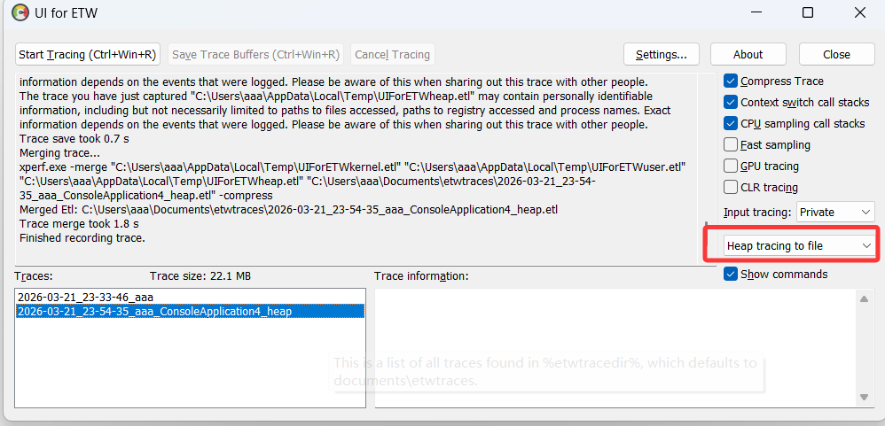
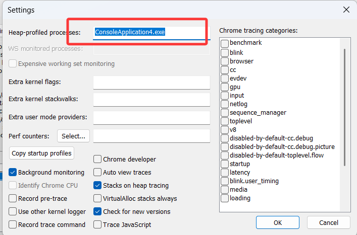
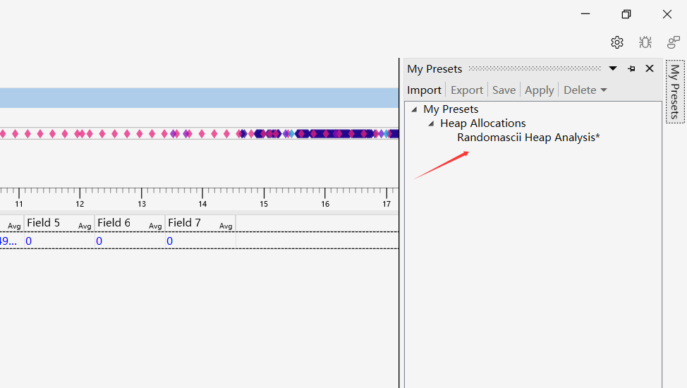
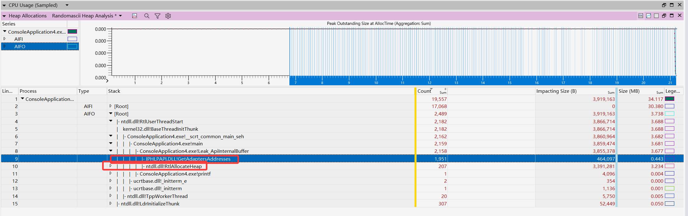

之前有部分分析的步骤在readme.md.old。

当时windbg对32位程序的内存泄漏的分析不是很好，基本等于没分析出来，但是目前工作遇到的客户端基本都是32位的。

最近发现了一个用etl用的很厉害的人的博客，学习一波用etl分析堆内存泄漏。

https://randomascii.wordpress.com/2015/04/27/etw-heap-tracingevery-allocation-recorded/

、

我按照博客里的设置，然后抓ETL，分析ETL。

用WPA打开后，然后双击右边的这个的view，这是作者写的view profile相当于是，不是wpa自带的界面设置。

具体看这两个。

Leak_ApiInternalBuffer中间调用GetAdaptersAddresses和HeapAlloc。

调用HeapAlloc的内存207次没有释放，GetAdaptersAddresses中间的1951次是系统分配的没有释放。我们只需要关注自己释放的没分配就行了。不过这个Demo太简单了，不确定实际分析中有没有用。

